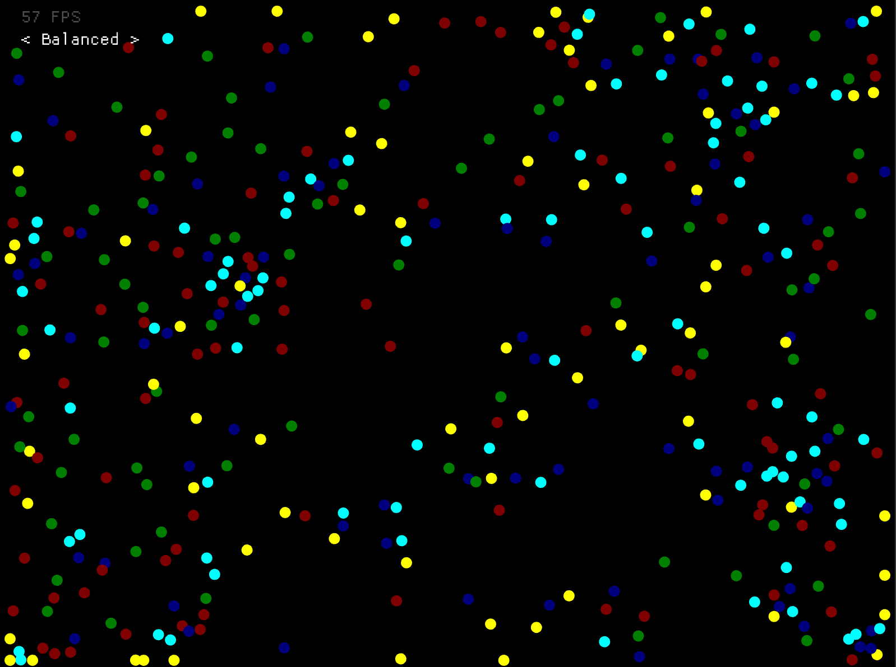

# Particle Life in Rust

An implementation of [Particle Life](https://github.com/fnky/particle-life)
written in Rust.

Originally based on [HackerPoet's C++
implementation](https://github.com/HackerPoet/Particle-Life).

> **Disclaimer:** The code is not optimized and not very "Rust-y" as I'm just
> using this project to learn Rust. I won't be able to review and accept all
> pull requests, but don't let that stop you from contributing to the project.

## Building

To run the project in debug mode, run

```sh
cargo run
```

Keep in mind that this will run at a low performance, especially with multiple
steps per frame, as only a few optimizations are made.

If you only care about checking out the demo itself, you can also build in
release mode:

```sh
cargo run --release
```

## Keyboard shortcuts

- `Left`/`Right` – Change the simulation preset.
- `Space` – Hold to simulate multiple steps per frame.

## Screenshot


